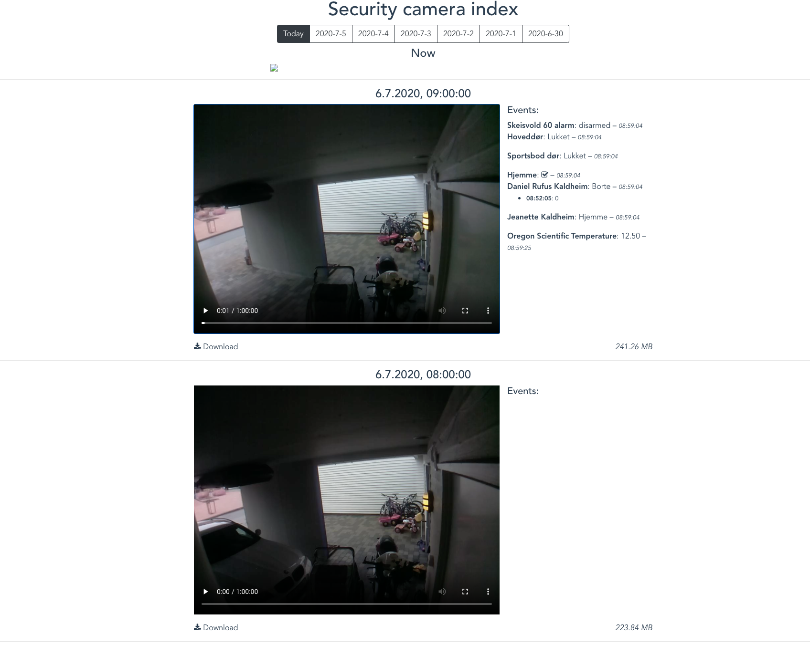

# Security Camera Recorder

I have multiple Raspberry Pi Zero with cameras around the house and wanted a simple recorder and previewer of these web-cameras. In addition to getting the camera feed I wanted to get the data from [Home Assistant](https://www.home-assistant.io/) to display events on the time and date the recording was done. This is a simple POC of this concept.

The Raspberry Pi Zero is using [mjpg-streamer](https://github.com/jacksonliam/mjpg-streamer).

## Screenshot

